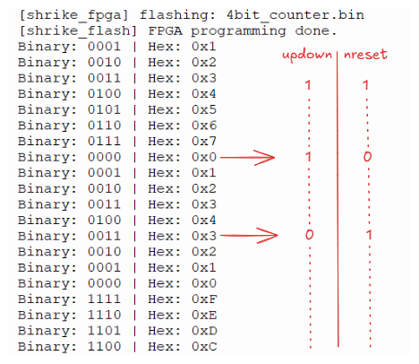
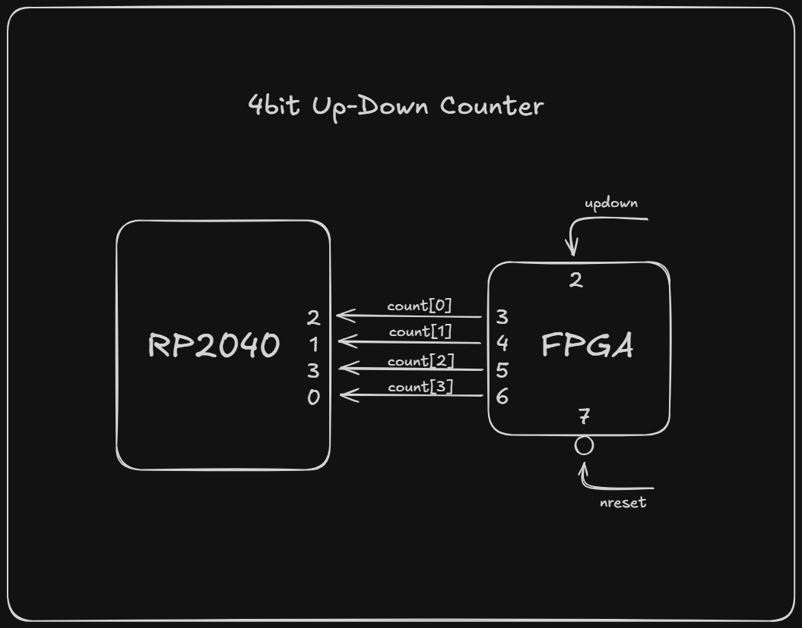

# counter_4bit

**Difficulty:** Beginner  
**Uses MCU:** Yes  
**External Hardware:** None  

## Overview

This example implements a 4-bit up/down counter on the FPGA and demonstrates how the MCU reads FPGA-generated data in real time. You will learn basic synchronous digital design, FPGA-to-MCU communication, and how to reconstruct parallel data using GPIO inputs.

## Compatibility

| Board | Firmware | Status |
|-------|----------|--------|
| Shrike-Lite (RP2040) | `firmware/arduino-ide/` | ✅ Tested |
| Shrike (RP2350) | `firmware/arduino-ide/` | ✅ Tested |
| Shrike-fi (ESP32-S3) | `firmware/arduino-ide/` | ❌ Not Tested Yet |

> FPGA bitstream is the same across all boards.

## Hardware Setup

No external hardware required.

The FPGA outputs a 4-bit counter value on GPIO pins, which are read by the RP2040:

| Signal     | FPGA Pin | RP2040 Pin |
|-----------|----------|------------|
| `count[0]` | GPIO3 | GPIO2 |
| `count[1]` | GPIO4 | GPIO1 |
| `count[2]` | GPIO5 | GPIO3 |
| `count[3]` | GPIO6 | GPIO0 |

Control signals:

| Signal   | FPGA Pin | Description |
|----------|----------|-------------|
| `nreset` | GPIO7 | Active-low reset |
| `up_down` | GPIO2 | Count direction control |

## Quick Start (Pre-Built Bitstream)

1. Connect your Shrike board via USB  
2. Upload `bitstream/counter_4bit.bin` using ShrikeFlash  
3. Run the MicroPython script  
4. Expected result: Counter values printed in binary and hexadecimal format showing up and down counting  

## Build From Source

### FPGA (Verilog)
1. Open `counter_4bit.ffpga` in Go Configure Software Hub  
2. Click **Synthesize → Generate Bitstream**  
3. Output will be in `ffpga/build/`  

### Firmware (MicroPython)
1. Open `firmware/micropython/counter_test.py` in Thonny  
2. Select MicroPython (RP2040) interpreter  
3. Run the script  

## How It Works

The FPGA implements a 4-bit synchronous up/down counter using a clock divider to slow down counting. The counter continuously drives its value onto GPIO pins.

The RP2040 reads these GPIO signals, reconstructs the 4-bit value using bitwise operations, and prints the result. Control signals such as reset and count direction allow interaction between the MCU and FPGA.

## Expected Output

The RP2040 prints values like:

## 6. Hardware Diagram & Significance

*Serial Output from RP2040 showing the up-counting, reset, and down-counting functionality of the counter.*

>Note: Noise and Interference on the GPIO input pins of the FPGA is also considered as a logic high (1). Thus, Physical connection of input pins to 3.3V to stay in up-counting mode or to stay out of reset is simply not required in this scenario.